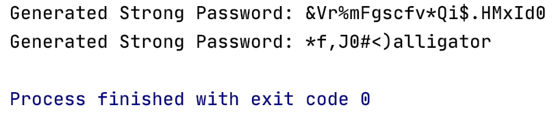

# Password Generator

Generate two passwords randomly. 
One with a keyword and one without.
Specify password length.
Password must contain one uppercase letter, one lowercase letter,
one number, one symbol, and contain at least 12 characters in order to be considered secure.

